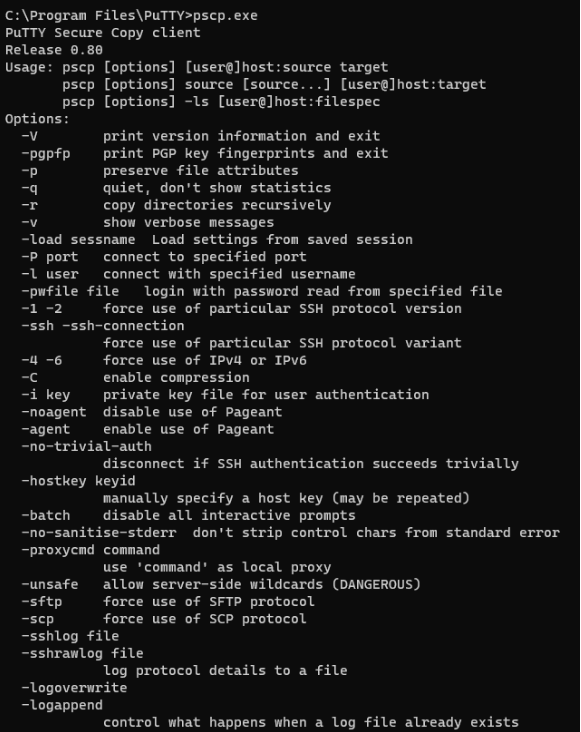
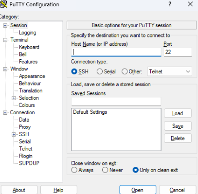
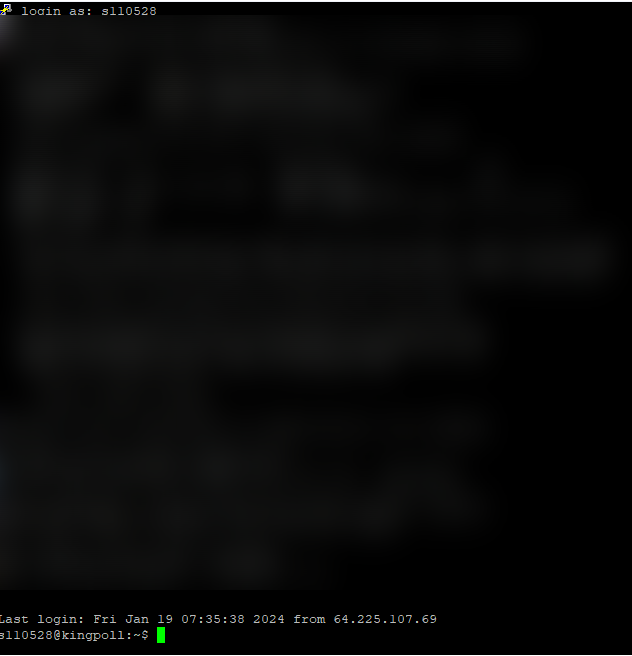

>PuTTY는 SSH, 텔넷, rlogin, raw TCP를 위한 클라이언트로 동작하는 자유 및 오픈 소스 단말 에뮬레이터 응용 프로그램이다.
https://ko.wikipedia.org/wiki/PuTTY

Windows OS에서 사용하는 무료 오픈 소스 터미널 에뮬레이터이다. 사용자는 원격 서버에서 이를 이용해 작업을 수행할 수 있다.

PuTTY가 다운되어 있는 해당 디렉토리로 이동해 cmd를 실행시켜, 아래와 같은 명령어를 입력할 시 사용할 수 있는 명령어를 확인할 수 있다.

PuTTY를 구성하기 위해 앱을 실행할 수 있다. 아래는 실행화면을 나타낸다.

- Category : PuTTY의 필요한 설정 및 기능 목록
- Host Name (or IP address) : 원격 서버의 IP 기입
- Port : 원격 서버의 접속 Port 기입
- Connection Type : 원격 서버로 접속할 방식을 선택, 방식에 따라 Port가 다르다.
- Saved Sessions : 자주 사용한 서버들을 저장하고 바로 불러올 수 있다.

해당 화면에서 리눅스 계정의 아이디와 비밀번호를 알맞게 입력했다면, 로그인에 성공한다.

혹시 몰라서 모자이크 처리 해놨다. kingpoll 은 이번 프로젝트의 이름이다.