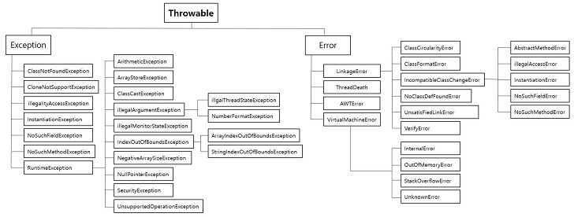

### Exception과 Error는?

Error 는 컴파일 시 문법적인 오류와 런타임 시 
널포인트 참조와 같은 오류로 프로세스에 심각한 문제를 야기 시켜 프로세스를 종료 시킬 수 있다.

Exception 은 컴퓨터 시스템의 동작 도중 예기치 않았던 이상 상태가 발생하여 
수행 중인 프로그램이 영향을 받는 것우로 예를 들면, 연산 도중 넘침에 의해 발생한 끼어들기 등이 이에 해당한다.

근데 사실 큰 차이를 못느꼈는데, 저번에 들었던 이야기도 있고 해서 다시금 리마인드로다가..

에러의 경우는 복구할 수 없는 심각할 정도의 오류, 예외는 해당 문제가 발생하더라도 경고 정도로 끝나는(수습가능) 전자에 비해
비교적으로 덜하다.

예외는 개발자가 구현한 로직에서 발생한다. 
개발자가 다른 방식으로 처리가능한 것들로 JVM은 정상 동작한다.

그리고 이 예외에서 두 가지로 나뉘는데 

- Checked Exception
  - 예외처리가 필수적이고, 처리하지 않게 되면 컴파일 되지 않는다. 앞에 throws를 붙인다던가..
- Unchecked Exception
  - 컴파일 때 체크되지 않으며 Runtime 때 발생하는 Exception이다.(Compile 다 하고 JVM Runtime 때.)

그리고 처리 방식에서 try catch와 throws의 방식을 택할 때
저번 팀프로젝트에서 이런 상황이 있었으나, 왜 그랬는지(try catch 처리) 기억이 안 난다. 그래서 물어봤는데

비즈니스 예외로 래핑했다던지(래핑해서 정상 흐름으로 돌려서 응답해줘야만 한다.), Runtime Exception이 아니던지..
잘 모르겠으나 그 뒤로는 아마 조직에 따라서 다를 수도 있다곤 하니 이정도로만 알면 되지 않을까 싶다.

