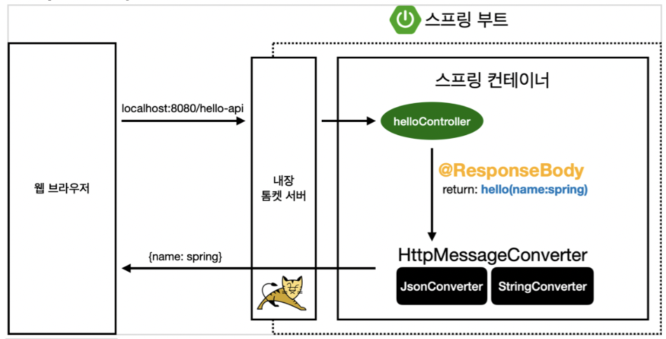
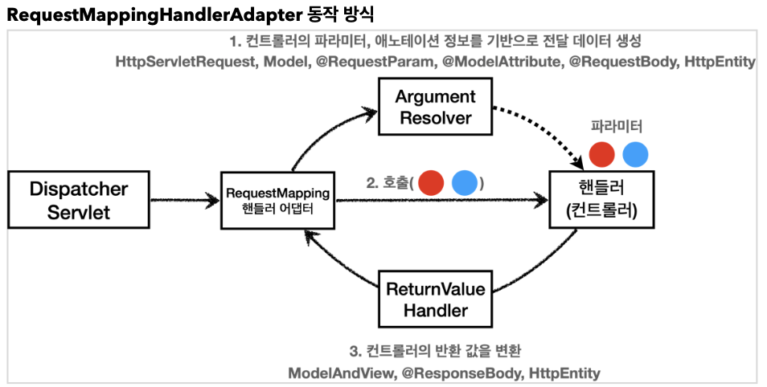

지인이랑 이야기하는데, 이러한 질문을 받게 되었다.

`ResponseBody가 있을 때와 없을 때 응답이 어떻게 나올까 ?` -> `Json의 형태로 나오거나, String으로 나오거나.`
-> `그렇다면, ResponseBody는 어떻게 Json 형태로 바꿔서 변환시켜주는 것일까?`



<Spring boot 내부 동작 간략한 사진>

@ResponseBody를 사용하게 된다면, ViewResolver 대신에 HttpMessageConverter가 동작하게 된다.
(@RestController를 사용한다면, @ResponseBody를 사용한 것과 같이 결과값의 형태가 Json으로 나간다.
왜냐하면, @RestController가 @ResponseBody를 갖고 있기 때문이다.)

String과 같이 기본 문자 처리에 대해서는 StringHttpMessageConverter를 사용한다. 인스턴스에 관한 처리는
MappingJackson2HttpMessageConverter를 사용한다. 

이 외에 여러 케이스에 맞는 Converter 들이 내부적으로 등록이 되어 있어, 맞게끔 사용한다.

보통 사용자가 요청 데이터를 보낼 때 @RequestBody, HttpEntity(ResponseEntity) - ResponseEntity 는 HttpEntity 를 확장한다.
응답 데이터를 보낼 때는 @ResponseBody, HttpEntity(ResponseEntity)

### 동작 과정 

```java
public interface HttpMessageConverter<T> {

    boolean canRead(Class<?> clazz, @Nullable MediaType mediaType);

    boolean canWrite(Class<?> clazz, @Nullable MediaType mediaType);

    List<MediaType> getSupportedMediaTypes();

    default List<MediaType> getSupportedMediaTypes(Class<?> clazz) {
        return (canRead(clazz, null) || canWrite(clazz, null) ?
                getSupportedMediaTypes() : Collections.emptyList());
    }

    T read(Class<? extends T> clazz, HttpInputMessage inputMessage)
            throws IOException, HttpMessageNotReadableException;

    void write(T t, @Nullable MediaType contentType, HttpOutputMessage outputMessage)
            throws IOException, HttpMessageNotWritableException;

}
```

canRead(), canWrite() 메서드를 통해서 읽고 쓸 수 있는지에 대해 여부를 확인한다. Converter는 요청/응답 모두 사용되기 때문이다.

그 후에 read, write 메서드를 통해 읽고 쓰는 동작을 실행하게 된다. canRead, canWrite에서 MediaType을 체크한다. 

ByteArrayHttpMessageConverter, StringHttpMessageConverter, MappingJackson2HttpMessageConverter 모두 Converter이다.

- ByteArrayHttpMessageConverter
  - byte 배열의 데이터를 처리한다. Class Type은 byte[]이고, MediaType은 */*이다.
- StringHttpMessageConverter
  - String 데이터를 처리한다. Class Type은 String이고, MediaType은 */*이다.
- MappingJackson2HttpMessageConverter
  - Json 데이터를 처리한다. Class Type은 인스턴스 or HashMap 이고, MediaType은 application/json 이다.

그렇다면 Converter는 어디에서 적용이 되는가 ? 

그 Spring MVC 과정에 @RequestMapping 어노테이션이 HandlerMapping과 HandlerAdapter 에 대한 정보를 주게 되는데
**Converter는 이 HandlerAdapter를 수행하는 과정**에서 이루어진다.

RequestMappingHandlerAdapter의 동작 방식은 아래와 같다.



그래서 HandlerAdapter가 컨트롤러를 호출하기 전에 ArgumentResolver를 통해서 
해당 컨트롤러의 parameter, annotation 정보를 기반으로 전달 데이터를 생성한다. 그림에도 나와 있듯이
HttpServletRequest, Model, @RequestParam, @ModelAttribute, @RequestBody, HttpEntity ... 

