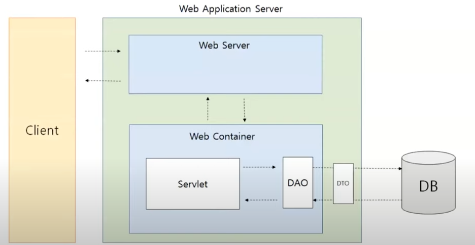

# Spring 과 Servlet

## Servlet 이란?

 Web 의 초기에는 정적인 컨텐츠(페이지)만 응답할 수 있었어요. 동적인 페이지를 제공하기 위해
프로그래밍을 통해 동적인 페이지를 생성할 수 있게 됐어요.
 Servlet이 바로 이 Web Server에 붙이는 프로그램 중 하나예요. 
 
### 그렇다면 이 Servlet 의 사용으로 인해 개발자들은 어떤 이득을 취할 수 있는가?

HTTP Request와 Response 가 존재해요. 요청이 들어오면, 그에 맞게 응답을 해줘야만 해요. Request를 통해
개발자가 그것을 읽고 일일이 직접 Response 를 만들어야 된다면 굉장히 작업이 힘들고 어려워요.
왜냐하면 모든 규약을 확인하고, 굉장히 긴 텍스트로 들어온 Request를 규약에 맞춰서 응답으로 보내줘야만 하기 때문이에요.

Servlet을 사용하게 된다면, Http Servlet 메서드를 통해서 간단하게 메서드를 가져올 수 있어요. 구태여, Http 요청을 직접 파싱하지 않아도 된다는
이점이 존재해요.
 그렇게 된다면 개발자들은 비즈니스 로직에 조금 더 집중할 수 있게 된다는 점이 또다른 이점이에요.

### Servlet Container, Servlet 의 과정들 ?

Servlet Container는 Client에게 Request를 받게 된다면 해당 Request와 매핑된 Servlet을 찾게 돼요.

그렇다면, Container는 어떻게 매핑된 Servlet을 찾을 수 있을까요?

servlet 설정 파일에서 URL 패턴에 맞게 작성되어 있는데, 그를 읽고 찾아내서 처리할 수 있게 돼요. 따라서 Container 안에서 찾아내서 존재한다면
그대로 가져와서 사용하는 것이고, 만일 없다면 생성(init 메서드)해서 가져가서 사용하게 되는 것이에요.

그 다음 Container 안에 Thread를 생성하고, 미리 만들어둔 HttpServletResponse, Request 객체를 인자로 Service를 호출해요.
Service 로직이 실행이 되고, Request, Response 객체는 소멸이 돼요. Servlet은 소멸하지 않아요.

소멸되지 않는 이유는 Servlet은 싱글톤으로 관리되기 때문이에요. 다음 요청에 의해 다시 한번 생성/소멸 하지 않고, 또다시 Container에 의해
호출돼서 사용하기 때문이에요. 이 Container는 결국 Servlet의 LifeCycle을 관리하는 객체예요.

### 만약, 요청을 처리하는 도중 다른 요청을 처리할 일이 생긴다면 ?

Multi Thread로 Request를 처리하게 돼요. 

Thread 당 Servlet이 생성이 되고, Thread 당 다른 Servlet이 처리할 수 있으며, 여러 Thread가 하나의 Servlet 에 요청을 보냈을 때 처리할 수도 있어요.

Multi Threading 은 Thread를 생성하는 것 자체가 큰 비용이 부담되고, 다른 Thread로 전환하는 Context Switch 때문에 Over Head를 일으키기 때문에 조심해야 해요.
때문에 Thread 생성 수를 제한하지 않는다면, 많은 Request를 처리하기 위해 그만큼 많은 Thread를 생성하다가 Server 의 한계를 넘어서면 Server 가 터질 수도 있어요.

이것은 관리의 측면에서 보았을 때의 관점이며, 개발의 관점에서 보자면 로직의 중복이 있어요. 

Request와 Response는 같은데, 개별적으로 처리할 로직들 (Servlet 별)이 존재하거든요. 이를 핸들러의 공통 로직 중복이라고도 할 수 있어요.
이러한 중복되는 로직들을 앞단에서 받아주고, 개별적으로 처리할 로직들은 따로 두어 위임해주게 된다면 중복을 피할 수 있고, 역할을 나눌 수 있게 돼요.

이를 Front Controller Pattern이라 해요. Spring MVC도 이 패턴을 따르고, 앞단에서 받아내고 보내주는 Controller(Servlet)을 Dispatcher Servlet 이라 불러요.

Servlet을 하나만 두고, 모든 요청을 다 받을 수 있도록 처리하는 것이지요.

이전에는 Servlet으로 요청을 수행할 때마다 매번 Thread를 생성했다면, Spring에서는 하나의 Servlet(Dispatcher Servlet)을 정의하고 그 Servlet이 모든 요청을 수행하도록 하는
전략을 따르게 되는 것이에요.

### Dispatcher Servlet Request, Response 의 처리 과정

[Spring MVC 흐름](https://github.com/yuuzinn/Java_Alone_Study/blob/master/src/java_deep/md/SpringMVC.md)

[Spring Response에 관해서](https://github.com/yuuzinn/ANYTHING_NOTE/blob/main/note/ResponseBody.md)

참고!

### Spring Container ? 

Servlet Container와 같이 Spring Container도 비슷해요. 

Spring에서 프로그램이 동작하는 동안의 사용되는 Java 인스턴스들을 Framework가 대신 관리해주고, 보관하기 위해 사용되는 바구니의 개념이에요.

Dispatcher Servlet 안에는 두 개의 WebApplicationContext 가 두 개가 존재해요.

하나는 Servlet WebApplicationContext, 또다른 하나는 Root WebApplicationContext 가 존재해요.

- Servlet WebApplicationContext
  - Controller, ViewResolver, HandlerMapping ... 
  - Web 요청처리 관련된 있는 빈들이 존재해요.
- Root WebApplicationContext
  - Service, Repository... 
  - Web 요청처리 관련된 빈 외의 Component 들이 존재해요.

그래서 설정 파일에 이러한 Bean들을 직접 담아주게 된다면, Spring은 이를 확인해서 필요할 때에 주입해서 사용해주게 된다는 것이지요.

따라서 최종적으로 개발자에게 있어서 요청처리 비즈니스 로직들만 신경쓸 수 있도록 해주는 것이에요.