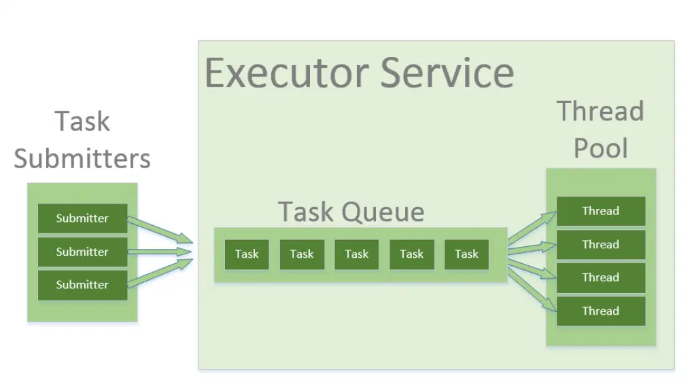

Spring boot 안에는 Servlet Container인 Tomcat이 존재한다. 이 안에서 Tomcat 에 관련된 설정들을 지정할 수 있다.

그 이전에 몇 가지 개념들을 정리하고 가는 것이 좋다.

> Thread

Thread란 무엇일까? `Thread는 실행 중인 한 프로세스 내에서 구분지어진 하나의 실행 단위이다.` 

실생활에서 예시를 들자면, 요리를 하려고 하는데 생선 손질하는 Thread1, 소스를 만들고 있는 Thread2...병렬적으로 작업을 처리할 수 있다.
이러한 작업이 이루어지는 단위가 바로 Thread이다.

컴퓨터의 CPU는 Thread 단위로 작업을 처리한다. CPU는 여러 Thread를 번갈아가며 실행해서 다중 작업을 처리한다.<br>
CPU를 엄청 짧은 시간으로 시분할(작업1->작업2->작업3->작업1->...)해서 사용하기 때문에 우리 눈에는 동시에 처리되는 것처럼 보이지만, <BR>
실제로는 여러 Thread를 번갈아가며 실행 중인 것이다.

> Thread, 그렇다면 Thread의 수가 많으면 많을 수록 좋은 거 아닌가?

Thread의 수가 많으면 그만큼 여러 작업을 처리할 수 있게 돼서 무조건 좋은 거 아닐까? <br>
이에 대해서 고려해볼 것이 꽤 존재한다.

- Thread는 생성할 때 메모리를 소모한다.
  - Thread가 생성되면, 해당 Thread는 실행할 때 필요한 메모리를 할당받는다.<br>
  따라서 생성할 때 메모리를 소모하게 된다. Thread가 많아지면 각 Thread가 차지하는 메모리가 점점 커져 메모리가 부족할 수도 있다.


- Thread가 많아지면 CPU의 자원 경합이 발생할 우려가 있다.
  - Thread가 많아지면 CPU 자원을 경합하는 경우가 발생할 수 있다._(Race Condition)_<BR>
  **하나 이상의 Thread가 데이터를 기록하려고 할 때, 다른 Thread가 해당 데이터를 읽으려고 하는 경우이다.**<br>
  이렇게 경합이 발생하면 Applcation에 예상치 못한 동작이 발생할 수 있다.


- Thread가 많아지면 CS(Context Switching) 비용이 커진다.
  - 여기서 CS란, CPU에서 실행중이던 Thread가 다른 Thread로 바뀌는 과정을 이야기한다.
  - CS중에 바뀐 Thread의 정보를 변경해야 하는데, 이 때 CPU가 해당 CS를 수행하여 CPU의 시간을 소모한다.<BR>
  따라서 CS가 일어나면 CPU의 시간을 소모하게 된다.
  - Thread가 많으면 많을 수록 Thread 간의 전환이 빈번해질 것이며, 이에 따라서 CS 비용이 커질 것이므로 CPU의 시간을 소모하게 되고<BR>
  더 나아가선 CPU에 오버헤드가 발생하여 성능 저하의 우려가 있다.

이렇게 Thread가 많으면 많을 수록 Side-effect가 일어날 확률이 높아질 수밖에 없기 때문에, 이를 고려해 적당한 Thread의 개수를 지정하는 것이 옳다.

---

> Thread Pool

`Thread는 생성할 때 메모리를 소모한다`

Thread Pool은 이러한 문제를 보완한다. Thread Pool에 한 번 생성한 Thread를 저장해놓는 방식으로 이를 해결한다.

따라서 Thread Pool은 Thread의 저장소라고 생각할 수 있다. Thread는 생성되고 작업을 수행한 후 소멸하는 것이 아니라 Thread Pool 내에 남아 있게 된다.<br>
이후에 작업 처리가 필요하면 해당 Thread를 재사용하여 작업을 처리할 수 있다. 이로써 성능을 향상시킬 수 있는 것이다. 메모리적으로 크게.

작업 처리는 아래의 그림과 같이 되어 있다.



1. Thread Pool에 작업을 요청한다.
2. 작업 요청이 Task Queue에 하나씩 쌓인다.
3. Task Queue에 쌓인 작업들을 Thread Pool에 있는 Thread가 하나씩 가져가서 처리한다. <br>
만약, 처리할 Thread가 현재 남아 있지 않다면, Task Queue에 해야할 작업들이 순서대로 쌓여 있다.

---

> Tomcat의 설정

Tomcat에서 여러 설정들을 지정할 수 있다.

- threads.min-spare : 톰캣 스레드 풀에 대기 상태로 있는 스레드 개수
- threads.max : 스레드 풀이 '동시에' 사용할 수 있는 최대 스레드 개수
- max-connections : Tomcat 서버가 '동시에 처리할 수 있는 최대 클라이언트 연결 수'
- accept-count : max-connections 이상의 요청이 들어 왔을 때 사용하는 요청 대기열 큐의 사이즈<br>
만약 max-connections 이상의 연결 시도라서 요청 대기열 큐에 저장되는데, 요청 대기열 큐의 사이즈인 accept-count 보다도 연결 시도가 많아지면 연결을 거부한다.

Java의 Thread Pool과 Tomcat의 Thread Pool의 차이는 `Accept-count`과 관련이 있다.<br>
`max-connections 이상의 요청이 들어 왔을 때 사용하는 요청 대기열 큐의 사이즈`<br>

Java 의 Thread Pool의 Queue는 작업 큐로, 작업 요청이 들어오면 무조건 작업 큐를 거쳐서 Thread를 할당받는다.<br>
Tomcat에서 사용되는 Queue는 **요청 대기열 큐로, `max-connections`이상의 요청이 들어왔을 때 작업이 저장**된다.


```properties
server:
  tomcat:
    accept-count: 5
    max-connections: 150
    threads:
      max: 50
      min-spare: 20
```

> min-spare: 20

기본적으로 Thread Pool에 대기 상태로 존재하는 Thread가 20개가 있다.

> max: 50

Thread Pool이 동시에 사용할 수 있는 최대 Thread 개수로, 50개의 요청을 동시에 처리할 수 있다.<br>
만약에 동시에 50개의 요청이 오면, 대기 상태인 20개의 Thread를 제외하고, 30개의 Thread가 생성되어 50개의 요청을 동시에 처리한다.<br>
Tomcat Connetor는 50개의 TCP Connection을 가지고 있다.

> accept-count: 5

만약 100개의 요청이 오면, 최대 Thread 개수인 50개만큼 요청을 처리하고, 5개씩 작업 큐에 저장한다.

> max-connections: 150

만약 200개의 요청이 오면, 150개의 요청이 수락되고 요청 대기열 큐 사이즈(accept-count)인 5만큼 요청이 수락되고, <br>
나머지 45개의 요청은 거절된다.(이때, 요청 대기열 큐에 저장되는 작업들은 TCP Connection을 맺지 않고 있다.)