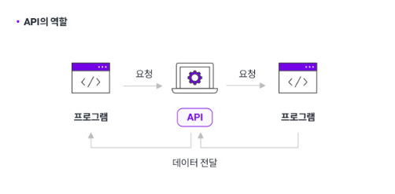
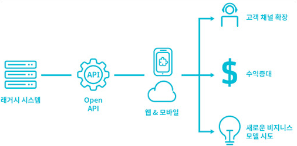

# API란 무엇인가?

Open API는 어떤 원리로 가져오는 것인가?에 대해 잠깐 생각해보던 중에 나 자신에게 물었던 질문이다.

>API란 무엇인가?

생각해보니 뭐라 정의할 수가 없어서, 면접에서 질문을 받을 때 뭐라 답을 해야할지 모르겠다. 때문에 이 기회에 제대로 정리하여 알아보려고 한다.

API는 `어떠한 방식으로 정보를 요청해야 하는지, 그러한 요청을 보냈을 때 어떠한 형식으로 무슨 데이터를 전달받을 수 있는지?`에 대해 정리한 
일종의 규격이라 말할 수 있다. 때문에 API의 풀네임은 아래와 같다.

`Application Programming Interface` 그렇다. 말 그대로 인터페이스의 개념이다. 

### API는 왜 필요할까?

- 개발 및 관리의 효율성 증가
  - API를 사용하면, 실제로 서비스가 어떻게 구현되어 있는지 몰라도 그 서비스를 토대로 가져와 사용할 수 있다.
  즉, 매번 새로운 개발을 할 필요가 없이 이미 만들어 놓은 기능을 간편하게 가져다 쓸 수 있게 되는 것이다.
  - 이 덕에 개발 시간은 줄어들고, 개발에 필요한 비용도 아낄 수 있게 되어 큰 이득을 볼 수 있다. 
  - 또한 API 문서들을 보며 어떻게 사용해야하는지 자세히 적혀 있기 때문에 보면서 사용하면 된다.
- 유연성과 확장성에 대해
  - 서비스의 신규 개발과 웹/앱 등 채널 확장이 쉽다. 타사 서비스와의 연계에 있어 큰 강점을 자랑한다.
  예를 들어서 이번 자사의 Applicaiton에서 추가할 기능 중 하나가 '지도'일 경우, 지도를 직접 개발하는 것보다
  이미 구현이 되어 있는 구글이나 네이버가 제공하는 지도 API를 불러온다면, 쉽게 구현할 수 있을 뿐더러 개발 시간도 줄일 수 있다.

### REST API는 그럼 무엇일까?

API를 구현하는 방식들 중 하나가 대표적으로 꼽히는 것이 REST API이다. REST는 `Representational State Transfer`의 약자이다.

`REST`한 방식, `RESTful API`.. 등 같이 불린다.

`Represent`의 뜻은 `표현하다`라는 뜻이다. 따라서, `요청 자체만으로 내가 무엇을 원하는지 알게 할 수 있는 것`이 바로 핵심이다.
Client와 Server는 고유한 URL을 통해 Reqeust와 Response를 주고받게 되는데, 이 URL만 보고 어떤 데이터를 원하는지 알 수 있게 한다.

이러한 방식은 Web의 장점을 가장 잘 살릴 수 있고 간결하고 효율적인 방식이라는 점이다.

---

보통 API의 구조는 아래와 같다.

OpenAPI의 구조도 비슷하다. 거의 같다고 보면 된다. 아래의 사진은 예시이다.

