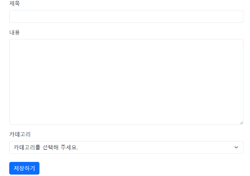
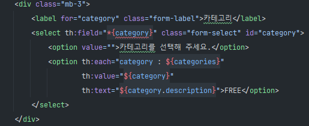
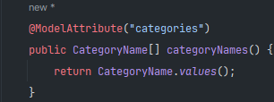
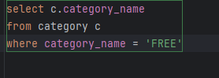

# Enum Type With JPA / Thymeleaf

JPA에서 enum type을 column으로 관리하고 싶을 때가 있다.

Entity 클래스 안에 예를 들어서 Member table의 status 라던지, Order table의 OrderTable, Board table의 Category... 등등

이번에 간단하게 Thymeleaf를 이용해 게시판 하나를 만들어 가고 있을 때의 이슈를 작성하고자 한다.

>Request에 Enum 값으로

Request 값으로 다른 Field들과 함께 서버로 데이터를 전송하고자 했다.

글을 작성할 때면 보통 글 제목, 글 내용을 작성하는데, 카테고리를 추가해서 같이 보내고 싶었다.

Request 용도로 사용될 Class 에는 String 값의 제목, 내용이 있었으며 Category Type의 카테고리를 넘겨주는 방식으로 작성했다. 하지만 이의 방식이 제 생각대로 되지 않았고, 곧바로 에러를 마주하게 되었다.

프린트로 콘솔에 Request 값을 찍어서 확인해 보았으나, 글과 내용은 제대로 들어왔고 카테고리 값은 null 값으로 들어오는 문제였다.

그렇다면 Thymeleaf에서 값을 잘못 받아오는 것일까? 했지만 그것도 아니다.

> 이를 해결하기 위한 여러 가지 시도

텍스트 값으로는 아주 잘 나왔으며, 문제 없었기 때문이었다. 구글링 중에 Enum type으로 넘겨줄 때는 어노테이션 @ModelAttribute를 사용해 enum 타입의 배열을 같이 넘겨줘야 알 수 있다는 사실을 확인했고, 똑같이 작성해서 성공을 기대해 봤으나, 이 역시도 실패...

가장 유사한 답을 보게 되었던 글에서는 @Jsoncreator? 어노테이션으로 역직렬화를 해야 된다는 글을 봤는데 이건 정말 아닌 것 같았다. 왜냐하면 나는 Json 형태로 내보낼 이유가 없기 때문... 그렇기에 이 방법은 아니라 판단했다.

도대체 왜 Null 값으로 들어오는 걸까? 앞서 작성했던 어노테이션으로 정보를 넘겨줬다고 생각했는데 거기서는 못찾는 구조인가?

**그렇다면 Request로 보낼 Category 타입을 String 으로 바꿔서 보내주면 받을 수나 있을까?** 해서 보내봤는데, 잘 받아와졌다. 이로써 Thymeleaf 는 틀리지 않았다는 사실이 증명되었다.

이번엔 String 으로 넣어주면 Board Entity를 어떻게 저장해야할까.. Category 타입을 넣어줘야 하는데, 이것도 문제였다.

String 값으로 보내고, CategoryRepository를 만들어서 where값에 parameter로 넣고, 찾아서 가져오면 안 될까?

되는 거 아닐까???????? 했는데 안됐다. 왜?????

exception들을 읽어봤는데, 여러 이유들이 나왔다. 너가 보낸 값이 String인데, 여기는 enum 타입이라서 안 된다니.. String 값을 어케 숫자로 바꾸느냐(?)니.. 아니 그런데 쿼리로 보낼 땐 String으로 찾아도 잘만 나오는데 이건 왜 안 된다는 건지 이해가 안 됐다.

이 외에도 여러 가지 눈물나는 구글링과 말도 안되는 시도를 해 보았으나, 보기 좋게 모두 다 실패...

그냥 enum 타입 포기해야되나.. 싶었지만 포기하고 싶지 않았다. 나중에 확장성을 위해서(카테고리 값이 더 추가될 수 있으니까) 꼭 넣고 싶었다.

> 해결

생각해보면 앞서 enum 타입을 배열로 저장한다고 했었다. 그러면 Repositroy에서도 List 타입으로 카테고리들을 가져오면 어떻게 될까?

결론은.. 그게 정답이었다.

물론 다른 방법이 있을 수도 있지만, 나는 이렇게 해서 풀어냈다. String 값으로 parameter를 주면 위와 같은 에러를 마주할 테니 String을 enum 값으로 변경했고, 그 값을 다시 Repository에 WHERE 절로 넘겨주어 List 타입으로 반환하게끔 처리했다.

프론트에서 자유 or 팁을 선택할 시 List 타입으로 찾아서 하나만 받아오게 되었고, 어차피 하나의 요소만 가지고 있기에 인덱스 0번째의 Category를 가져와 Builder를 통해 Board를 save했다.

> 여담

별 거 아닌 문제인데도 머리 끙끙 앓으며 미치는 줄 알았는데, 해결하니 30년 묵은 때가 내려가는 이 느낌..

이게 도파민이지................ 그리고 enum 타입 request를 찾아보면서 괜찮은 글을 보게 되었다. 나중에 필요할 수 있을 거 같아 아래에 링크를 걸어두려고 한다.

[Enum Type Request에 대해?](https://kim-jong-hyun.tistory.com/152)

---