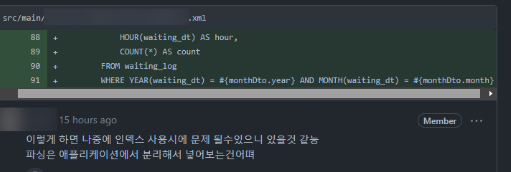
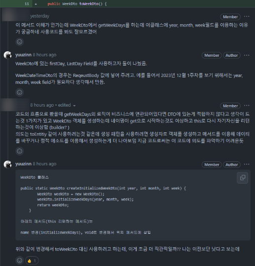

프로젝트 중 메모하고 싶은 것들을 계속해서 작성해 나갈 예정

---

### Index란 대체?


인덱스 사용 시에 무슨 문제가 있을지 고민이었다.
리뷰어의 `파싱은 Application에서 분리해서 넣어 보는게?`라는 말이 조금 이해하기 어려웠다.(지식부족)
내가 이해하기로는 저기에 monthDto.year 매개변수 값을 Application 단에서 분리해 parameter로 넣어야 되는 줄 알았다.
```
(@Param ("year") Integer year, @Param ("month") Integer month)
```
하지만 아니었다. MySQL 쿼리문의 YEAR, MONTH 함수를 쓰지 말고 해보라는 의미였다.
왜 사용하는 것을 지양하고, 다른 방법을 권유한 것인가? 나는 의미를 몰랐어서 찾아본 결과, 찾기는 어려웠다. 찾던 와중 MySQL 속도 개선 TIP 들 중 알게 된 것들이 있는데, 이것은 아래에 출처로 남겨 놓는다.

DB 에서 조회할 때에는 DB 데이터는 변경하지 말고 조회하는 것이 좋다. 웬만하면. 그래야 인덱스를 탈 수 있다. 이전부터 궁금했던 것이 있는데, 그렇다면 이 인덱스라는 것은 도대체 어떻게 타게 하는 것인가? 의문이었다.

물론 따로 설정이 있는 것인지 아직은 잘 모르겠으나, PK를 설정할 때에 기본적으로 주어진다는 것인지.. 아직 DB가 많이 부족해서 잘 모르겠다. 그리고 들은 바로는 인덱스 만든다고 인덱스가 써지는 게 아니라는 것이다. 써지게끔 유도해야되는 것이 인덱스.

현재 컬럼 데이터의 정보를 기존 데이터와 다르게 변경시켜서 사용하게 될 경우, 인덱스 사용을 못한다.

일단은 이정도만 알고 있어도 된다 하니, 기억하고 있자.

그런데 알고 있으라 해도 이해가 안 됐다. 현재 컬럼 데이터와 기존 데이터를 다르게 변경시켜서 사용한다니? 이게 무슨 말일까 몰랐는데, 바로 이해가 됐다.

YEAR, MONTH 절에서 기존 데이터는 DATE 형식으로 들어가 있다. 하지만 이 함수를 사용해서 불러오게 될 때, 각각 년, 월로 잘라져서 (변경) 나오기 때문에. 바로 그 이유이다. 이 얘기 듣고 공중제비 5바퀴 돌았다.
### Rest API ?
URL에 대해서 한참을 고민했었다. 리소스별로 나눌 생각은 안 하고, 어떻게 하면 이거를 조금 더 잘 표현할 수 있을지...
```
/api/waiting/average/...
```
이런 식으로 쭉 나열해서 Controller에서 사용했었지만, 조금 잘못된 표현이었다. 잘못됐다기보단 이상했으려나?
이번에도 리뷰를 통해 듣게 되었다. 이 경우 path 별로 각각 Entity가 아니니, 이어주는 게 맞는 거 같다라는 의견을 들었고 나도 그에 대해 크게 동의했다.
```
/api/waiting-average-.../../..
```
이렇게 리소스별로 표현해줌으로써 조금더 알맞는 표현이 되겠다. 다음부터 이렇게 URL로 표현할 일이 있다면, 각 Path 별로 Entity에 맞게 잘 써 줬는지 한번 더 생각해볼 필요가 있다. 그때에는 잘 맞춰서 더 잘 표현해보고 싶다.

### 날짜(주 차)의 표현 방법과 정적 메서드
주간 통계 쿼리를 위해 메서드를 하나 만들었다. 이의 역할은 주마다 첫날, 마지막날의 날짜를 구해오는 메서드였다. 처음에는 주차 별로 어떻게 알아야 될지 팀원끼리 상의해 룰을 하나 만들었다.

보통 몇 주차를 계산할 때 어떻게 계산할까? 월요일부터 일요일을 한 주로 치고 계산한다. 우리는 그렇게 계산하지 말고, 아예 1일부터 7일은 1주, 8일부터 14일은 2주.. 달력이 어떻게 되었든, 그렇게 표현하고자 정했다.

월요일부터 일요일을 한 주로 치지 않는 이유는 달력마다, 매 해마다 다 달력이 바뀌고, 한 달 마다 첫 주와 마지막 주에 달이 바뀌기 때문에 통계내기에 굉장히 까다로웠다. 따라서 위와 같이 룰을 정했다.


이 메서드를 구현하고 리뷰를 받는데, 어려움이 존재했다. 나는 정적 메서드를 따로 만들 생각은 하지 않았으며 이 메서드의 역할만을 생각했다.

그런데 내가 봐도 메서드가 이상하긴 했다. 필드에 집어 넣으려고 this 를 사용해서 집어넣고 다시 this로 return 한다던지.. toEntity 의 의도도 아니었을 뿐더러, 정적 메서드에 대해서도 잘 몰랐다. 이전에 5월에 팀 프로젝트를 진행할 때도 멘토님께 정적 팩토리 메서드에 대해서 잠깐 들은 적이 있었는데, 역시 너무 어렵다.

이번 기회에 정적 메서드에 대해서 조금 듣게 된 것은 보통 정적 메서드로 생성하면 기본 생성자로 private로 생성해줘야만 한다. 그 이유는 생성을 강제하기 때문이다. 그렇지 않다면 정적 메서드를 쓰는 의미가 없어지기에...

이번에 저 메서드는 정적 메서드로 쓸 것은 아니지만, 리뷰를 통해서 조금 더 직관적이고 깔끔한 메서드로 변경해 사용하기로 했다. 공부하다 쉬는 시간에 이 메서드 패턴에 대해서 검색해 알아보던지 해야겠다.

---

```
Strict stubbing argument mismatch. Please check:
- this invocation of 'getTodayPartySize' method:
  waitingMapper.getTodayPartySize(
  2023-12-15T00:00:00.298837800,
  2023-12-15T21:17:53.298837800
  );
  -> at com.king.app.application.waiting.PartySizeServiceImpl.getTodayPartySizeAverage(PartySizeServiceImpl.java:25)
- has following stubbing(s) with different arguments:
    1. waitingMapper.getTodayPartySize(
       2023-12-14T00:00:00.278354500,
       2023-12-15T21:17:53.278354500
       );
```

Test 코드 작성 중 LocalDateTime.now() 함수를 사용할 때가 있었다. 매개변수로 넣어주고 실행했더니 위와 같은 에러를 마주했다. 이건 아직도 모르겠다. 위의 에러 말고도 비슷하게 계속 오류가 나타났는데, 시간이 아예 똑같음에도 인수가 다르다고 계속 오류를 나타냈다. 왜 그런지 이해가 안 됐다........ 시간을 고정해줘야만 하는 건가?

찾아보니 Clock 이라는 클래스가 있는 거 같던데, 해결방법보다는 원인이 너무나도 궁금하다.

---

Enum class 의 데이터는 DB에 String 형태 그대로 들어가는 게 아니다. 따라서 DB에 Enum type 이 어떻게 들어가는지 꼭 확인해야만 한다.
String type으로 보내주고 싶다면, 아래의 어노테이션을 넣어줌으로써 맞게 넣어줄 수 있다.
```
@Enumerated(EnumType.STRING)

public enum EnumType {
/** Persist enumerated type property or field as an integer. */
ORDINAL,

    /** Persist enumerated type property or field as a string. */
    STRING
}
```
우리 로직의 흐름과 Redis, SSE 알림에 대해서...

### 대략 흐름
사용자는 WAS에 회원가입 시도 -> was는 사용자에게 redirect 해서 kakao에게 토큰 발급 받음 (우리가 해주는 거 아님) -> token 을 가지고 redis에 저장하는 형식 (Provider 에 대해서 한번 물어봐야될듯)

### Redis
redis 키는 사용자 pk (DB KEY) : 핸드폰 번호 : 인원수 형식으로 저장되어 있다. 예시로는 아래와 같다.
1 : 01011112222 : 2
이런 형태로 저장하는 이유는 Kako TTL 때문에 그렇다. 기본적으로 세션 타임아웃 30분으로 잡아 놓기 때문에, 세션이 만료되면 우리는 핸드폰 번호와 인원수를 알 수 없다.

물론, 30분이란 시간 동안 고객이 대기하는 경우는 거의 없으나 혹시 모르기도 하고 (Redis에 영구적으로 저장해 key 값으로 불러올 수 있기 때문) pk값으로 나머지의 값을 확인할 수 있음.

Redis Sort를 통해서 대기 손님의 순서를 정할 수 있다. 입력한 순으로 Redis 에 들어와서 관리할 수 있음. 뒤로가기, 맨 뒤로 가기가 이것으로 관리하는 것임.

### 알림
SSE에서는 SSE 객체를 생성해서 사용하는데, 이것들을 LIST로 관리한다. 사용자(대기 손님)마다 객체를 하나씩 만들어서 이 LIST에 저장한다.

그런 다음 send() 라는 메서드를 이용해서 push 를 통해 사용자들에게 알림을 보내주는 형식이다. 예를 들면, 사용자가 맨 뒤 순번으로 이동한다던지, 자기 순번의 바로 뒷 순번으로 이동한다던지 등등...

이것을 push 기반 알림(틀릴 수도 있음 기억이 긴가민가)이라 한다.

그리고 우리는 리스닝을 하고 있기 때문에 웹이 동적으로(실시간) 변한다. 대기가 늘어나면 실시간으로 늘어남을 볼 수 있음.

